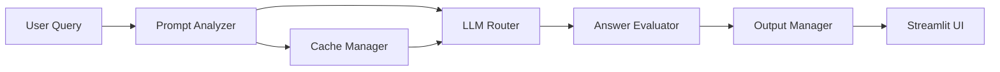

# 🌐 BRIDGE AI - Intelligent LLM Routing System

> An advanced AI routing system that intelligently directs user queries to the most appropriate language model based on complexity, context, and quality requirements.

## 🚀 Key Features

- **Smart Model Routing**: Dynamically routes queries to optimal LLMs (GPT-3.5, GPT-4, etc.) based on complexity, context, and quality requirements.
- **Quality Assessment**: Continuously evaluates response quality and can upgrade to more capable models when needed.
- **Context-Aware Processing**: Supports multiple conversation styles (Academic, Business, Technical, etc.) with specialized handling for each.
- **Semantic Caching**: Reduces API calls and improves response times through intelligent caching of similar queries.
- **Modular Architecture**: Clean separation of concerns with distinct components for API, LLM routing, and data persistence.
- **Secure Authentication**: JWT-based API key authentication with secure credential handling.
- **Extensible Design**: Easy to add new LLM providers, analysis modules, or storage backends.

## 🏗 System Architecture

### Core Components

1. **LLM Bridge** (`llm_bridge/`)
   - `bridge.py`: Orchestrates the entire query processing pipeline
   - `llm_router.py`: Routes queries to appropriate LLM models
   - `prompt_analyzer.py`: Analyzes prompt complexity and requirements
   - `answer_evaluator.py`: Assesses response quality and suggests improvements
   - `cache_manager.py`: Manages both exact and semantic caching

2. **API Layer** (`api/`)
   - FastAPI-based RESTful API
   - JWT authentication
   - Request validation and logging middleware
   - User management endpoints

3. **Data Layer** (`data_layer/`)
   - MongoDB integration with connection pooling
   - Semantic search capabilities
   - User and conversation history storage

4. **User Interface** (`bridge_ui/`)
   - Streamlit-based web interface
   - Responsive design for various devices
   - Real-time chat interface

## 🔄 Routing Flow Overview

This section illustrates the internal flow of query processing in the BRIDGE system — from the moment a user submits a question, through analysis, routing, and response generation.

### 📈 Sequence Diagram


### 🧭 Step-by-Step Flow

1. ***User submits a query*** — including optional metadata such as vibe, confidence, or nature_of_answer.

2. ***Prompt Analyzer (prompt_analyzer.py)*** determines the intent, complexity, and style of the input.

3. ***Cache Manager (cache_manager.py)*** checks for matching or semantically similar cached responses to reduce unnecessary API calls.

4. ***LLM Router (llm_router.py)*** selects the most appropriate model (e.g., GPT-3.5, GPT-4) based on the analysis.

5. ***Answer Evaluator (answer_evaluator.py)*** assesses the generated response for quality, coherence, and alignment with expectations.

6. ***Output Manager (output_manager.py)*** formats the final output (e.g., code blocks, follow-ups) and returns it to the UI.

7. ***UI Display (Streamlit)*** renders the response in a real-time chat interface.

## 🛠 Installation & Setup

### Prerequisites
- Python 3.8+
- MongoDB instance (local or cloud)
- OpenAI API key

### Quick Start

1. **Clone and set up the repository**
   
```bash
   git clone https://github.com/yourusername/bridge-ai.git
   cd BRIDGE
   
   # Create and activate virtual environment
   python -m venv venv
   .\venv\Scripts\activate  # Windows
   source venv/bin/activate   # macOS/Linux
   
   # Install dependencies
   pip install -r requirements.txt

2. **Configure environment variables**
   Create a .env file with required settings:
   
env
   # Required
   OPENAI_API_KEY=your_openai_api_key
   MONGODB_URI=mongodb://localhost:27017/bridge
   SECRET_KEY=your_secure_secret_key
   
   # Optional
   CACHE_TTL=86400  # 24 hours
   LOG_LEVEL=INFO


## 🚀 Running the Application

### Start the API Server
```bash
export PYTHONPATH=$PWD
python -m api.entry_point_api --reload --port 8000 
```

### Start the Web Bridge UI
```bash
streamlit run bridge_ui/loginUI.py
```

### Start the TV Manual Agent
```bash
streamlit run TVManualAgent/main.py
```
  
## 📚 Project Structure

```
BRIDGE_v2.2.1/
├── api/                    # API implementation
│   ├── __init__.py
│   ├── entry_point_api.py  # Main API endpoints
│   ├── authHandler.py      # Authentication logic
│   ├── userHandler.py      # User management
│   ├── middleware/         # Request processing middleware
│   ├── logs/              # API logs
│   └── tests/             # API test suite
│
├── llm_bridge/            # Core routing and processing logic
│   ├── __init__.py
│   ├── bridge.py          # Main orchestrator
│   ├── llm_router.py      # Model routing
│   ├── prompt_analyzer.py # Prompt analysis
│   ├── prompt_enhancer.py # Prompt enhancement
│   ├── answer_evaluator.py # Response evaluation
│   ├── response_classifier.py # Response classification
│   ├── cache_manager.py   # Caching system
│   ├── output_manager.py  # Response formatting
│   └── test/             # Test suite
│
├── data_layer/            # Data persistence
│   ├── __init__.py
│   └── mongoHandler.py    # MongoDB operations
│
├── bridge_ui/             # Web interface
│   ├── chatUI.py         # Main chat interface
│   ├── loginUI.py        # User authentication
│   ├── static/           # Frontend assets (CSS, JS, images)
│   └── __init__.py       # Package initialization
│
├── cache/                # Cache storage
├── logs/                 # Application logs
└── requirements.txt      # Python dependencies
```

## 🔍 API Documentation

### Authentication
All API endpoints (except `/health`) require authentication via API key in the `X-API-Key` header.

### Available Endpoints

#### Health Check
- `GET /health`
  - Verify API status and database connectivity
  - No authentication required

#### User Management
- `POST /register`
  - Register a new user account
  - Returns: API key for authentication

- `POST /login`
  - Authenticate and receive API key
  - Returns: API key for authentication

#### LLM Interaction
- `POST /ask-llm`
  - Process a natural language query
  - Required fields:
    ```json
    {
      "vibe": "Academic/Research",
      "sender_id": "user123",
      "question": "Explain quantum computing",
      "confidence": true,
      "nature_of_answer": "Detailed"
    }
    ```
  - Returns: 
    ```json
    {
      "response": "Detailed explanation...",
      "vibe_used": "Academic/Research",
      "question_id": "abc123",
      "model_metadata": {
        "model_used": "gpt-4",
        "processing_time": 1.23,
        "cache_hit": false
      },
      "follow_up_questions": ["What are qubits?", "How does quantum entanglement work?"],
      "needs_more_info": false
    }
    ```

## 🤖 Supported Vibe Modes

| Vibe | Description | Best For |
|------|-------------|----------|
| **Academic/Research** | Detailed, citation-heavy responses | Research papers, academic work |
| **Business/Professional** | Formal, strategic business language | Business communications, reports |
| **Technical/Development** | Code-focused explanations | Software development, technical docs |
| **Daily/General** | Casual, conversational tone | Everyday questions, general chat |
| **Creative/Emotional** | Expressive, empathetic responses | Creative writing, emotional support |

## 🛡️ Security Considerations

- All API keys are stored securely using environment variables
- Passwords are hashed using bcrypt before storage
- JWT tokens are used for authenticated sessions
- Input validation is performed on all API endpoints
- CORS is enabled with appropriate security headers

## 📈 Performance

- Response times typically under 2 seconds for most queries
- Semantic caching reduces duplicate API calls
- Connection pooling for database operations
- Asynchronous processing for non-blocking I/O

## 🤝 Contributing

1. Fork the repository
2. Create a feature branch
3. Commit your changes
4. Push to the branch
5. Create a new Pull Request

## 📝 License

This project is licensed under the MIT License - see the [LICENSE](LICENSE) file for details.

## 🙏 Acknowledgments

This project was built with ❤️ as part of a collaborative effort by a talented team of women developers and data scientists.

### 👩‍💻 Team Members 
- [**Shlomit Levavi**](https://www.linkedin.com/in/shlomit-levavi)
- [**Nadia Brandes**](https://www.linkedin.com/in/nadia-brandes)
- [**Ilana Levintal**](https://www.linkedin.com/in/ilana-levintal-989805196)
- [**Yana Gabelev**](https://www.linkedin.com/in/yanagabelev)

> We proudly designed BRIDGE as a modular, AI-powered system that reflects both technical depth and collaborative spirit.

### 👨‍🏫 Mentorship Acknowledgment  
Special thanks to [**Arik Vaserman**](https://www.linkedin.com/in/arik-vaserman-1b575231), instructor and mentor at the Bar-Ilan Data Science Program, for his invaluable guidance, support, and inspiration throughout the project.

### 🔗 Technologies & Resources
- Built with [FastAPI](https://fastapi.tiangolo.com/) and [Streamlit](https://streamlit.io/)
- Powered by [OpenAI](https://openai.com/) GPT models
- Semantic search using [Sentence Transformers](https://www.sbert.net/)
- MongoDB for persistence and vector-based caching
- Icons by [Feather Icons](https://feathericons.com/)