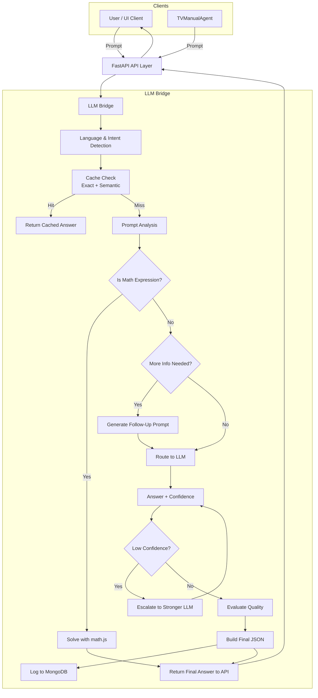

# 🌐 BRIDGE AI - Intelligent LLM Routing System

## 📌 Overview

**BRIDGE AI** is a smart and modular router between multiple Language Models (LLMs), designed to analyze incoming prompts, determine confidence levels, and dynamically select the most appropriate model—whether internal or external (e.g., OpenAI’s GPT-3.5/4).  
The system features real-time logging, semantic caching, intent detection, and a modern UI dashboard for tracing model behavior.

## 📌 Quick Navigation

- [Key Features](#-key-features)
- [System Architecture](#-system-architecture)
- [Module Docs](#-module-docs)
- [Core Components](#-core-components)
- [Execution Flow Summary](#-execution-flow-summary)
- [Project Structure](#-project-structure)
- [Environment Setup](#️-environment-setup)
- [Running the Application](#-running-the-application)
- [API Reference](#-api-reference)
- [License](#-license)
- [Acknowledgments](#-acknowledgments)

📎 **Module Sub-Docs:**

- [`llm_bridge/`](./llm_bridge/README.md) — Core routing logic: prompt analysis, model selection, caching, formatting.
- [`api/`](./api/README.md) — FastAPI backend: endpoints, auth handlers, rate limiting, logging.
- [`data_layer/`](./data_layer/README.md) — MongoDB integration: storage, embedding cache, user sessions.
- [`bridge_ui/`](./bridge_ui/README.md) — Streamlit UI: real-time chat, dashboard, session management.

## 🚀 Key Features

### ***🔁 Smart Model Routing***
- Dynamically routes queries to the optimal LLM (e.g., GPT‑3.5, GPT‑4, or local models) based on **context**, **intent**, **complexity**, and required **confidence**.

### ***🧠 Context-Aware Processing***
- Supports multiple **response vibes** (Academic, Business, Technical, Creative, etc.) with tailored prompting and formatting.

### ***🧭 Intent & Language Detection***
- Detects user **intent** and **input language** (currently English-only), and routes accordingly or flags unsupported input.

### ***🎯 Confidence Scoring & Model Escalation***
- Parses confidence from `[CONFIDENCE:X.XX]`. If below threshold, BRIDGE **escalates** to stronger LLM.

### ***💾 Semantic Caching (MongoDB)***
- Embedding-based cache for semantic similarity — reduces **latency** and **token costs**.

### ***🧮 Token-Aware Logging***
- Tracks **token usage** per request (prompt + completion), enabling usage monitoring & rate limiting.

### ***🔐 Secure Authentication***
- API Key-based access with **optional JWT**, rotating keys, guest access, and **granular agent control**.

### ***🧩 Modular Architecture***
- Clean separation of concerns:
  - API logic: `entry_point_api.py`
  - User/Auth: `userHandler.py`, `authHandler.py`
  - LLM Bridging: `bridge.py`
  - Persistence: `mongoHandler.py`

### ***📊 Real-Time Logging & Monitoring***
- Logs request metadata, response time, and exceptions via **middleware**. Supports optional **log rotation**.

### ***🧠 Chain-of-Thought (CoT) Ready***
- Future-ready: structure allows integration of **multi-step reasoning** and explanation generation.

### ***💡 Extensible by Design***
- Modular: add new **models**, **storage**, or **tools** (e.g., RAG, LangChain) with minimal code changes.

### ***🖥️ Optional UI Dashboard (Streamlit)***
- Real-time UI with **chat logs**, **vibe selectors**, **confidence gauge**, and **usage stats**.


## 🏗 System Architecture



## 🧩 Core Components

**1. LLM Bridge Layer** (`llm_bridge/`)

Orchestrates the entire flow from query intake to LLM output formatting.

| Module                | Functionality                                                                                                       |
| --------------------- | ------------------------------------------------------------------------------------------------------------------- |
| `bridge.py`           | Central orchestrator of the query pipeline. Receives all inputs and returns structured responses.                   |
| `llm_router.py`       | Smart routing between LLM1, LLM2, LLM3, and `TVManualAgent` based on intent, complexity, confidence, and user type. |
| `prompt_analyzer.py`  | Parses the question to assess its complexity and tone.                                                              |
| `prompt_enhancer.py`  | Refines prompts for clarity, depth, or Chain-of-Thought enhancement.                                                |
| `answer_evaluator.py` | Evaluates LLM responses using heuristic and statistical methods; can trigger re-routing.                            |
| `cache_manager.py`    | Manages both exact-match and embedding-based semantic caching (MongoDB).                                            |
| `output_manager.py`   | Formats, normalizes, and packages the final response for UI/API consumption.                                        |

**2. API Layer** (`api/`)

Exposes the system via a secure, flexible FastAPI backend.

| Functionality        | Details                                                                                                  |
| -------------------- | -------------------------------------------------------------------------------------------------------- |
| `/ask-llm/` endpoint | Accepts question payloads, injects vibe, processes via `bridge.py`, and returns full response.           |
| Auth & headers       | API Key via `X-API-Key`, optional `X-Username` or `X-Agent-ID` for role control.                         |
| Auth modules         | `authHandler.py`, `userHandler.py`, `agentHandler.py` — with JWT fallback, key rotation, and guest mode. |
| Middleware           | Logs every request/response, tracks timing and errors, limits usage.                                     |
| Rate limiting        | Built-in logic for throttling based on user tokens.                                                      |
| Validation           | Pydantic models ensure every payload is safe and well-structured.                                        |

**3. Data Layer** (`data_layer/`)

Provides persistent storage and caching.

| Module            | Capability                                                          |
| ----------------- | ------------------------------------------------------------------- |
| `mongoHandler.py` | Handles chat logs, embeddings, cache checks, user and session data. |
| Indexes           | Embedding-based for semantic cache                                  |
| Models            | `chat_logs`, `users`, `tokens`, and `agents` collections            |
| Connection        | Pooled and retry-backed using `pymongo`                             |


**4. User Interface** (`bridge_ui/`)

Optional real-time UI via Streamlit.

| Feature    | Description                                    |
| ---------- | ---------------------------------------------- |
| UI         | Streamlit-based web interface                  |
| Responsive | Real-time chat interface                       |
| Authentication | User authentication and session management |

**5. TV Manual Agent** (`TVManualAgent/`)

A custom AI module designed to answer TV manual–related questions.

| Feature         | Description                                                                             |
| --------------- | --------------------------------------------------------------------------------------- |
| Input source    | PDF manuals of various TV models                                                        |
| Function        | Parses, indexes and semantically searches content                                       |
| Integration     | Plugged into `llm_router.py` as `LLM4` / route condition                                |
| Typical use     | If user question includes device keywords or instructions like "how to reset LG remote" |

## 🧠 Execution Flow Summary

1. A prompt is received via the public API (/ask-llm) — either from:
    - A regular user (via UI or HTTP client)
    - An external agent such as TVManualAgent
2. The API layer authenticates the request (X-API-Key, X-Agent-ID or X-Username)
3. The system analyzes:
    - Intent
    - Language
    - Vibe (response style)
    - Nature of answer (Short / Medium / Detailed)
4. The LLMRouter determines how to process the query:
    - Check if a cached semantic match exists (exact/embedding)
    - If not cached: route to a selected LLM:  
        - LLM1 — Local model
        - LLM2 / LLM3 — External APIs (e.g. GPT-3.5, GPT-4)
5. The selected LLM generates a response
    - If configured, confidence is appended as [CONFIDENCE:0.XX]
6. The system:
    - Parses the confidence
    - Optionally re-routes if confidence is low
    - Logs tokens, user/agent, embeddings, timestamp
7. The final structured response is returned to:
    - The user
    - Or to the agent, e.g., TVManualAgent, which can use it as fallback

## 📚 Project Structure

```text
BRIDGE/
├── api/                    # FastAPI application
│   ├── __init__.py
│   ├── main.py            # API entry point
│   ├── dependencies.py     # Dependency injection
│   ├── routes/            # API endpoints
│   └── models/            # Pydantic models
│
├── llm_bridge/            # Core routing logic
│   ├── __init__.py
│   ├── bridge.py          # Main orchestrator
│   ├── llm_router.py      # Model routing
│   ├── prompt_analyzer.py # Prompt analysis
│   ├── answer_evaluator.py # Response evaluation
│   ├── cache_manager.py   # Caching system
│   └── output_manager.py  # Response formatting
│
├── data_layer/            # Data persistence
│   ├── __init__.py
│   ├── mongoHandler.py    # MongoDB operations
│   └── models/            # Data models
│
├── bridge_ui/             # Web interface
│   ├── __init__.py        # Main orchestrator
│   ├── loginUI.py         # Authentication UI
│   ├── chatUI.py          # Chat interface
│   └── static/            # Frontend assets
│
├── TVManualAgent/         # TV Manual Agent    
│   ├── __init__.py        # Main orchestrator  
│   ├── Data/              # PDF files
│   ├── llm_load.py        # LLM loading
│   ├── pdf_load.py        # PDF loading
│   └── main.py            # Main app
│
├── tests/                 # Test suite
│   ├── unit/              # Unit tests
│   ├── integration/       # Integration tests
│   └── conftest.py        # Test fixtures
│
├── docs/                  # Documentation
│   ├── api/               # API documentation
│   └── guides/            # Usage guides
│
├── .env.example           # Environment template
├── requirements.txt       # Python dependencies
├── README.md              # This file
└── PROJECT_SPEC.md        # Detailed specification
```

## ⚙️ Environment Setup

1. Copy the example environment file:
   ```bash
   cp .env.example .env
   ```

2. Update the `.env` file with your configuration:
   ```env
   # API Configuration
   API_HOST=0.0.0.0
   API_PORT=8000
   DEBUG=True
   
   # Authentication
   SECRET_KEY=your-secret-key-here
   ACCESS_TOKEN_EXPIRE_MINUTES=1440  # 24 hours
   
   # MongoDB
   MONGODB_URL=mongodb://localhost:27017/
   MONGODB_DB_NAME=bridge_db
   
   # LLM Providers
   OPENAI_API_KEY=your-openai-key
   ANTHROPIC_API_KEY=your-anthropic-key
   
   # Caching
   CACHE_ENABLED=True
   CACHE_TTL=3600  # 1 hour
   ```

## 🚀 Running the Application

### Prerequisites
- Python 3.9+
- MongoDB (local or remote)
- Required Python packages (install via `pip install -r requirements.txt`)

### Starting the API Server
```bash
uvicorn api.entry_point_api:app --reload
```

### Starting the Web UI
```bash
streamlit run bridge_ui/loginUI.py
```

### Running the TV Manual Agent
```bash
streamlit run TVManualAgent/main.py
```

### Running the Dashboard
```bash
streamlit run dashboard_main.py
``` 

## 🔍 API Reference

### Authentication
All API endpoints require authentication via JWT token. Include the token in the Authorization header:
```
Authorization: Bearer <your-jwt-token>
```

### Key Endpoints

#### POST /api/v1/ask
Submit a query to the LLM routing system.

**Request Body:**
```json
{
  "prompt": "Your question here",
  "context": "Additional context if any",
  "vibe": "professional",
  "model_preference": "auto"
}
```

**Response:**
```json
{
  "response": "The generated response",
  "model_used": "gpt-4",
  "confidence": 0.95,
  "sources": ["source1.pdf", "source2.pdf"],
  "follow_up_questions": ["Related question 1", "Related question 2"]
}
```

## 🧪 Testing

Basic unit tests and integration tests are included under the tests/ directory.

⚠️ Note: The current test suite may be outdated and not fully compatible with recent architectural changes (e.g., TVManualAgent, llm_router, updated response structure).


## 📝 License

This project is licensed under the MIT License - see the [LICENSE](LICENSE) file for details.

## 🙏 Acknowledgments

This project was built with ❤️ as part of a collaborative effort by a talented team of women developers and data scientists.

### 👩‍💻 Team Members 
- [**Shlomit Levavi**](https://www.linkedin.com/in/shlomit-levavi)
- [**Nadia Brandes**](https://www.linkedin.com/in/nadia-brandes)
- [**Ilana Levintal**](https://www.linkedin.com/in/ilana-levintal-989805196)
- [**Yana Gabelev**](https://www.linkedin.com/in/yanagabelev)

> We proudly designed BRIDGE as a modular, AI-powered system that reflects both technical depth and collaborative spirit.

### 👨‍🏫 Mentorship Acknowledgment  
Special thanks to [**Arik Vaserman**](https://www.linkedin.com/in/arik-vaserman-1b575231), instructor and mentor at the Bar-Ilan Data Science Program, for his invaluable guidance, support, and inspiration throughout the project.

### 🔗 Technologies & Resources
- Built with [FastAPI](https://fastapi.tiangolo.com/) and [Streamlit](https://streamlit.io/)
- Powered by [OpenAI](https://openai.com/) GPT models
- Semantic search using [Sentence Transformers](https://www.sbert.net/)
- MongoDB for persistence and vector-based caching
- Icons by [Feather Icons](https://feathericons.com/)

