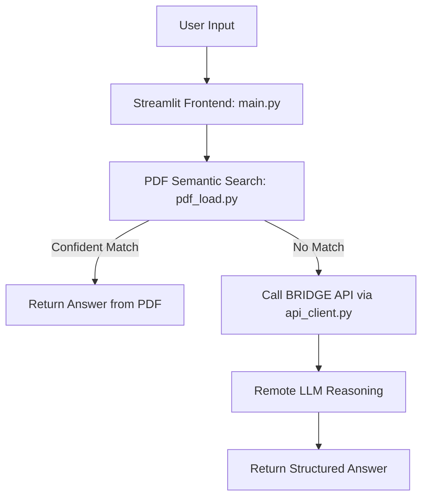

# 📺 TV Manual Agent

A standalone smart assistant for answering questions based on TV manuals.
Combines semantic search over embedded PDF data with fallback LLM reasoning via the BRIDGE API.

## 🧠 What It Does

- Accepts **TV manual PDFs** via local folder
- Answers natural-language queries (e.g., "How do I connect HDMI?")
- Prioritizes fast semantic lookup from embedded manuals
- Falls back to LLM Bridge when PDF data is insufficient
- Presents clean chat-like interface with source info and suggestions

## 🧱 Architecture



## ⚙️ Features

### 🔍 Hybrid QA Pipeline
- **Step 1**: Semantic search via FAISS over user manuals
- **Step 2**: If no confident result → fallback to `/ask-llm/` in BRIDGE
- **Step 3**: Render clean, structured responses with follow-up suggestions

### 📄 PDF Processing
- Extracts text from `.pdf` using `PyPDF2`
- Chunks into 500-word segments with 50-word overlap
- Embeds via `all-MiniLM-L6-v2` (SentenceTransformers)
- Indexes with FAISS (`faiss-cpu` or `faiss-gpu`)

### 🤖 LLM Support
- Load HuggingFace models dynamically via token
- Supports small chat models (e.g., DialoGPT, Llama)
- Prompts are auto-formatted per model requirements

### 🔗 Remote BRIDGE API (Fallback)
- Calls `/ask-llm/` endpoint with `question`, `vibe`, `confidence`, `sender_id`
- Uses `x-api-key` for secure access
- Returns structured JSON with answer, model info, confidence, and follow-up

## 🚀 How It Works (Pipeline)

1. **Extract Text** → from PDFs using PyPDF2
2. **Chunk Content** → into overlapping 500-word segments
3. **Create Embeddings** → using Sentence Transformers
4. **Build FAISS Index** → enables semantic search
5. **Answer Query** → via model or BRIDGE fallback


## 🧪 Example Use Cases

| Question                          | Behavior                        |
|-----------------------------------|---------------------------------|
| “How do I set parental controls?” | Searches manual PDFs            |
| No match found                    | Escalates to BRIDGE             |
| Bridge returns follow-up          | Chat UI renders it              |
| Want source context?              | Expand original PDF chunk view  |

## 📁 Current Manuals (Sample)

| File Name   | Description         | Size   |
|-------------|---------------------|--------|
| jvc.pdf     | JVC TV Manual       | 1.9 MB |
| smart.pdf   | Smart TV Guide      | 7.1 MB |
| tcl.pdf     | TCL TV Manual       | 1.3 MB |

To add more, simply drop new `.pdf` files into `/Data`.

## 🔧 Setup Instructions

### Setup checklist:
1. Make sure you have created a 'Data' folder in your project directory
2. Add your TV manual PDF files to the 'Data' folder
3. Install dependencies: `pip install -r requirements.txt`
4. Run the command above in VSCode terminal

### Troubleshooting:
- If streamlit is not recognized, try: `pip install streamlit`
- If you get permission errors, run VSCode as administrator
- For first-time model download, ensure good internet connection (13GB download)

### Before running the app make sure you have:
1. BRIDGE app API running
2. BRIDGE app API is accessible via `http://localhost:8000`

### Method 1: Direct command
```bash
streamlit run TVManualAgent/main.py
```

### Method 2: Using Python module
```bash
python -m streamlit run TVManualAgent/main.py
```

### 💬 Example Prompts
- “Where is the HDMI port?”
- “How to update firmware?”
- “Why is the screen blurry?”
- “How do I reset factory settings?”

### 📎 Related Projects
-  🔗 BRIDGE API: The LLM fallback system

