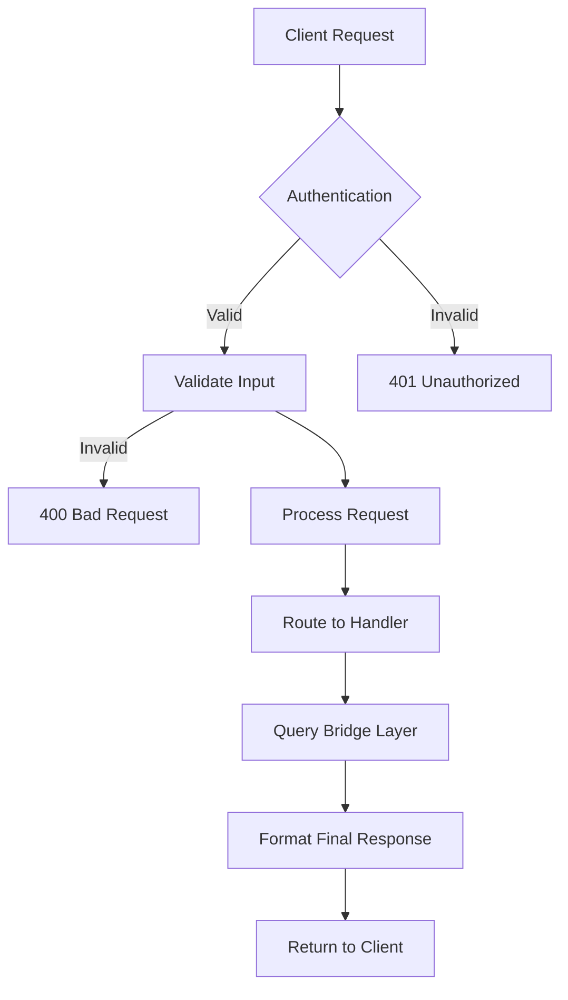
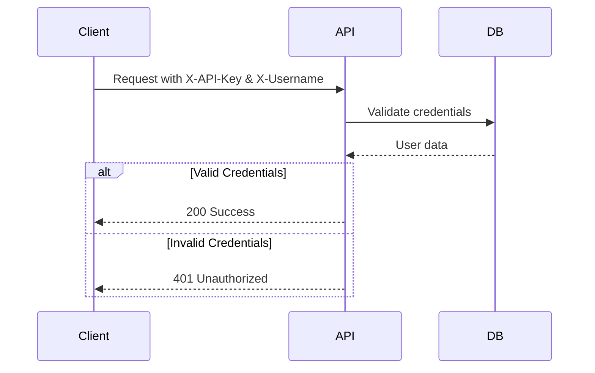

# 📡 LLM Bridge API

This FastAPI module serves as the entry point to the BRIDGE system.
It validates, logs, and routes requests to the internal LLM orchestration engine (llm_bridge/bridge.py).

🧠 Note: This module does not operate standalone — it depends on logic from llm_bridge/ and persistence from data_layer/.

## 🚀 Endpoints

### 🔹 POST /ask-llm/

Submits a user prompt and returns a structured response after model routing and confidence evaluation.

**✅ Request Body (JSON)**

| Field						  | Type			| Required	| Description                                                                |
| ----------------- | --------- | --------- | -------------------------------------------------------------------------- |
| question					| string		| ✅		    | The user’s input prompt                                                    |
| vibe			  			| string		| ⬜		    | Optional tone of response (e.g. "Professional")                            |
| confidence				| boolean		| ⬜		    | Whether to extract confidence from the LLM reply (default: false)          |
| nature_of_answer	| string		| ⬜		    | "Concise" / "Detailed" – optional format preference (default: "Concise")   |

**🔐 Headers**

 - X-API-Key: Your personal or agent key
 - X-Username: Optional user identifier (for UI session)
 - X-Agent-ID: Optional if sent by automated agent (e.g., TVManualAgent)

**✅ Response Body (JSON)**

| Field	              | Type		| Description                                                             |
| ------------------- | ------- | ----------------------------------------------------------------------- |
| response	          | string	| The generated response                                                  |
| model_used	        | string	| The LLM model used for processing                                       |
| confidence	        | float		| The confidence level of the response (only if confidence was requested) |
| sources	            | list		| List of sources used for the response                                   |
| follow_up_questions	| list		| List of follow-up questions                                             |

## 🔄 API Flow



## ⚙️ Dependencies

- This module requires:
  - llm_bridge.bridge — Main processing logic
  - data_layer.mongoHandler — Logging, embeddings, user sessions
  - Proper .env file (see project root)

## ⚠️ Note: The current test suite may not fully reflect new logic and some tests may fail or require refactoring to match the latest version.

## 🌟 Features

- **Structured Requests**: Send well-formatted prompts with configurable parameters
- **Multiple Response Styles**: Choose from different response vibes (Academic, Business, Technical, etc.)
- **Robust Authentication**: Secure API key and username-based authentication
- **Request Validation**: Comprehensive input validation with meaningful error messages
- **Request Logging**: Detailed logging for all API requests and responses
- **Health Monitoring**: Built-in health check endpoint
- **Async Support**: Fully asynchronous implementation for high performance
- **Comprehensive Testing**: Complete test coverage including authentication and error cases

## 🚀 Getting Started

### Prerequisites

- Python 3.10+
- MongoDB (for user management and logging)
- API key and username for authentication

### Install dependencies:
   ```bash
   pip install -r requirements.txt
   ```

### Run the API
   ```bash
   uvicorn api.entry_point_api:app --reload
   ```

   The API will be available at `http://localhost:8000`

## 📚 API Documentation

Once the API is running, you can access:

- **Interactive API Docs (Swagger UI)**: `http://localhost:8000/docs`
- **Alternative API Docs (ReDoc)**: `http://localhost:8000/redoc`

## 🔑 Authentication

The API uses API Key and Username authentication. Include both in the request headers:

- `X-API-Key`: Your API key
- `X-Username`: Your username (must match the username associated with the API key)



## 🛠️ Endpoints

### Health Check

```
GET /health
```

**Response:**
```json
{
    "status": "healthy",
    "version": "2.2.1",
    "timestamp": "2025-07-23T16:00:00.000Z"
}
```

### Register New User

```
POST /register
```

**Request Body:**
```json
{
    "username": "newuser",
    "password": "securepassword123",
    "email": "user@example.com"
}
```

### Login

```
POST /login
```

**Request Body:**
```json
{
    "username": "existinguser",
    "password": "userpassword"
}
```

### Ask LLM

```
POST /ask-llm
```

**Request Headers:**
- `X-API-Key`: Your API key
- `X-Username`: Your username

**Request Body:**
```json
{
    "vibe": "Technical/Development",
    "question": "How do I implement JWT authentication?",
    "confidence": true,
    "nature_of_answer": "Detailed"
}
```

## 📊 Error Handling

The API returns appropriate HTTP status codes and JSON error responses:

| Status Code | Description                  | Example Response                      |
|-------------|------------------------------|---------------------------------------|
| 400         | Bad Request                  | `{"detail": "Invalid request format"}` |
| 401         | Unauthorized                 | `{"detail": "Invalid API key"}`       |
| 404         | Not Found                    | `{"detail": "Endpoint not found"}`    |
| 422         | Validation Error             | `{"detail": [{"loc": ["string"], ...}]}` |
| 500         | Internal Server Error        | `{"detail": "Internal server error"}` |

## 📈 Rate Limiting



```mermaid
gantt
    title API Rate Limits
    dateFormat  HH:mm:ss
    axisFormat %H:%M
    
    section Requests
    Request 1  :a1, 2025-07-23T10:00:00, 1s
    Request 2  :a2, after a1, 1s
    Request 3  :a3, after a2, 1s
    Limit Reached :crit, active, after a3, 1s
    
    section Reset
    Counter Reset :crit, 2025-07-23T10:01:00, 1s
```

Current rate limits:
- 60 requests per minute per API key
- 1000 requests per day per user
