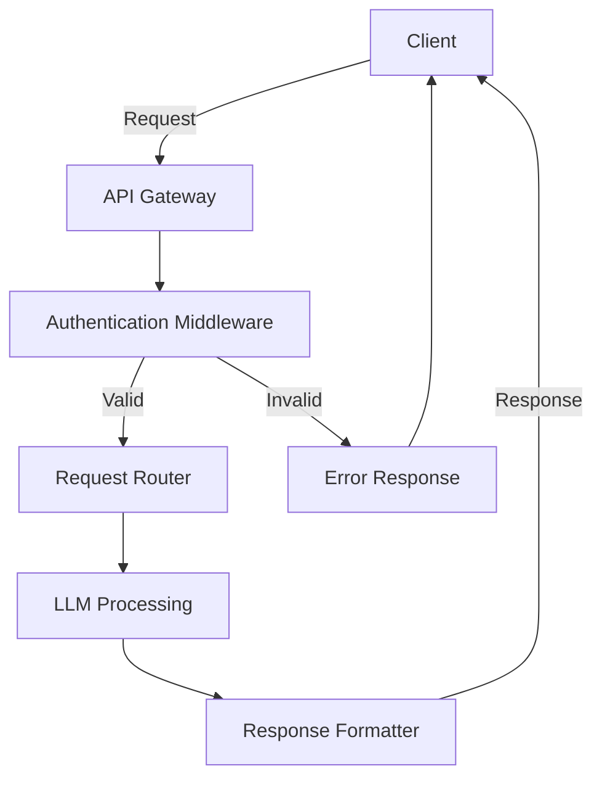
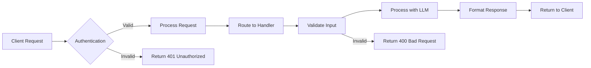

# LLM Bridge API

A FastAPI-based service that provides a structured interface for interacting with Large Language Models (LLMs). The API handles authentication, request validation, and response formatting, making it easy to integrate LLM capabilities into your applications.



## 🌟 Features

- **Structured Requests**: Send well-formatted prompts with configurable parameters
- **Multiple Response Styles**: Choose from different response vibes (Academic, Business, Technical, etc.)
- **Robust Authentication**: Secure API key and username-based authentication
- **Request Validation**: Comprehensive input validation with meaningful error messages
- **Request Logging**: Detailed logging for all API requests and responses
- **Health Monitoring**: Built-in health check endpoint
- **Async Support**: Fully asynchronous implementation for high performance
- **Comprehensive Testing**: Complete test coverage including authentication and error cases

## 🚀 Getting Started

### Prerequisites

- Python 3.10+
- MongoDB (for user management and logging)
- API key and username for authentication

### Install dependencies:
   ```bash
   pip install -r requirements.txt
   ```

### Run the API
   ```bash
   uvicorn api.entry_point_api:app --reload
   ```

   The API will be available at `http://localhost:8000`

## 📚 API Documentation

Once the API is running, you can access:

- **Interactive API Docs (Swagger UI)**: `http://localhost:8000/docs`
- **Alternative API Docs (ReDoc)**: `http://localhost:8000/redoc`

## 🔑 Authentication

The API uses API Key and Username authentication. Include both in the request headers:

- `X-API-Key`: Your API key
- `X-Username`: Your username (must match the username associated with the API key)


## 🛠️ Endpoints

### Health Check

```
GET /health
```

**Response:**
```json
{
    "status": "healthy",
    "version": "2.2.1",
    "timestamp": "2025-07-23T16:00:00.000Z"
}
```

### Register New User

```
POST /register
```

**Request Body:**
```json
{
    "username": "newuser",
    "password": "securepassword123",
    "email": "user@example.com"
}
```

### Login

```
POST /login
```

**Request Body:**
```json
{
    "username": "existinguser",
    "password": "userpassword"
}
```

### Ask LLM

```
POST /ask-llm
```

**Request Headers:**
- `X-API-Key`: Your API key
- `X-Username`: Your username

**Request Body:**
```json
{
    "vibe": "Technical/Development",
    "question": "How do I implement JWT authentication?",
    "confidence": true,
    "nature_of_answer": "Detailed"
}
```

## 🔄 API Flow



## 📊 Error Handling

The API returns appropriate HTTP status codes and JSON error responses:

| Status Code | Description                  | Example Response                      |
|-------------|------------------------------|---------------------------------------|
| 400         | Bad Request                  | `{"detail": "Invalid request format"}` |
| 401         | Unauthorized                 | `{"detail": "Invalid API key"}`       |
| 404         | Not Found                    | `{"detail": "Endpoint not found"}`    |
| 422         | Validation Error             | `{"detail": [{"loc": ["string"], ...}]}` |
| 500         | Internal Server Error        | `{"detail": "Internal server error"}` |

## 📈 Rate Limiting


Current rate limits:
- 60 requests per minute per API key
- 1000 requests per day per user

## 🧪 Testing

Run the test suite with:
```bash
pytest api/tests/
```

## � License

This project is licensed under the MIT License - see the [LICENSE](LICENSE) file for details.
