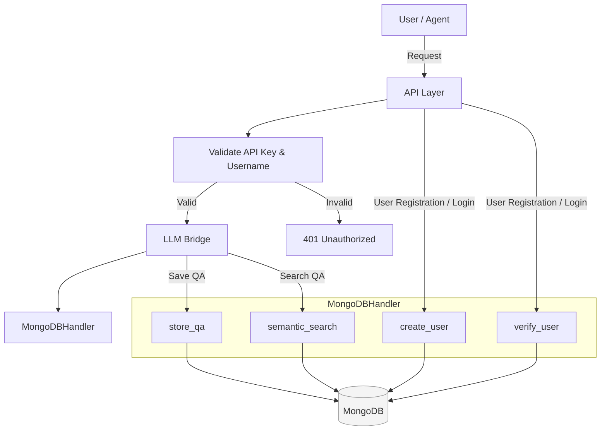

# 📦 Data Layer: MongoDB Backend

This module provides database connectivity and data persistence for the BRIDGE LLM Routing System.
It handles all read/write operations, including user accounts, chat logs, semantic search, and cache storage.

## ⚙️ Features

- **MongoDB Integration**: Singleton-based connection pool for efficient reuse
- **User Management**: Create, verify, and retrieve user accounts
- **QA Logging**: Stores prompts, responses, and associated metadata
- **Semantic Search**: Embedding-based search using SentenceTransformers
- **Caching Support**: Checks for exact and semantic matches before LLM execution
- **Error Handling**: Built-in retry and failure handling for robustness

## 🧭 Data Flow – MongoDBHandler



## 🔹 Functionality Table

| Method                                        | Purpose                                                       |
|-----------------------------------------------|---------------------------------------------------------------|
| `test_connection()`                           | Validates MongoDB connectivity                                |
| `create_user()`                               | Adds new users with hashed API keys                           |
| `verify_user()`                               | Verifies username and API key                                 |
| `store_qa()`                                  | Stores question, answer, metadata, and embeddings             |
| `semantic_search_by_prompt(prompt, threshold)`| Finds semantically similar past prompts                       |
| `search(prompt, threshold)`                   | Alias for `semantic_search_by_prompt` (for convenience)       |
| `get_conversation_history(username)`          | Retrieves chat history by user (if implemented)               |

## 🔹 Example Usage

### Semantic Search Example

```python
prompt = "how do I reset my LG TV?"
results = db.semantic_search_by_prompt(prompt, threshold=0.85)
for match in results:
    print("Found similar question:", match["question"])
```


## 🌱 Environment Variables

| Variable          | Description                          | Default                     |
|-------------------|--------------------------------------|-----------------------------|
| `MONGO_URI`       | MongoDB connection string            | — (required)                |
| `DB_NAME`         | Database name                        | `bridge_db`                 |
| `EMBEDDING_MODEL` | Sentence transformer model to use    | `all-MiniLM-L6-v2`          |

---

## 🔑 MongoDBHandler – Core Methods

| Category       | Method                                    | Purpose                                      |
|----------------|-------------------------------------------|----------------------------------------------|
| **Connection** | `test_connection()`                       | Checks MongoDB availability                  |
| **Users**      | `create_user(username, email, password)`  | Creates a new user                           |
|                | `verify_user(username, password)`         | Validates credentials                        |
|                | `get_user(user_id)`                       | Fetches user info                            |
| **QA Logs**    | `save_qa_record(user_id, question, ...)`  | Saves prompt/answer + metadata               |
|                | `get_conversation_history(user_id)`       | (If implemented) Load user history           |
| **Search**     | `semantic_search_by_prompt(...)`          | Finds semantically similar prompts           |
|                | `search(prompt, threshold)`               | Fallback method: exact first, then semantic  |

---

## 🧪 Testing

- ℹ️ *Note: Some test cases may require updates. Contributions are welcome.*

```bash
python test_mongodb_connection.py
```

## Dependencies

- Python 3.8+
- pymongo
- sentence-transformers
- scikit-learn
- python-dotenv

## Environment Variables

```
MONGO_URI=your_mongodb_connection_string
DB_NAME=bridge_db  # optional, defaults to 'bridge_db'
EMBEDDING_MODEL=all-MiniLM-L6-v2  # optional, defaults to 'all-MiniLM-L6-v2'
```

## Usage

```python
from data_layer.mongoHandler import db_handler

# Initialize connection (happens automatically on first use)
db_handler.test_connection()

# Create a new user
user_id = db_handler.create_user(
    username="testuser",
    email="user@example.com",
    password="securepassword"
)

# Save a QA pair
qa_id = db_handler.save_qa_record(
    user_id=user_id,
    question="What is FastAPI?",
    answer="FastAPI is a modern, fast web framework...",
    metadata={"source": "documentation"}
)

# Search for similar questions
results = db_handler.semantic_search_by_prompt(
    query="Tell me about FastAPI",
    threshold=0.8,
    top_k=3
)
```
