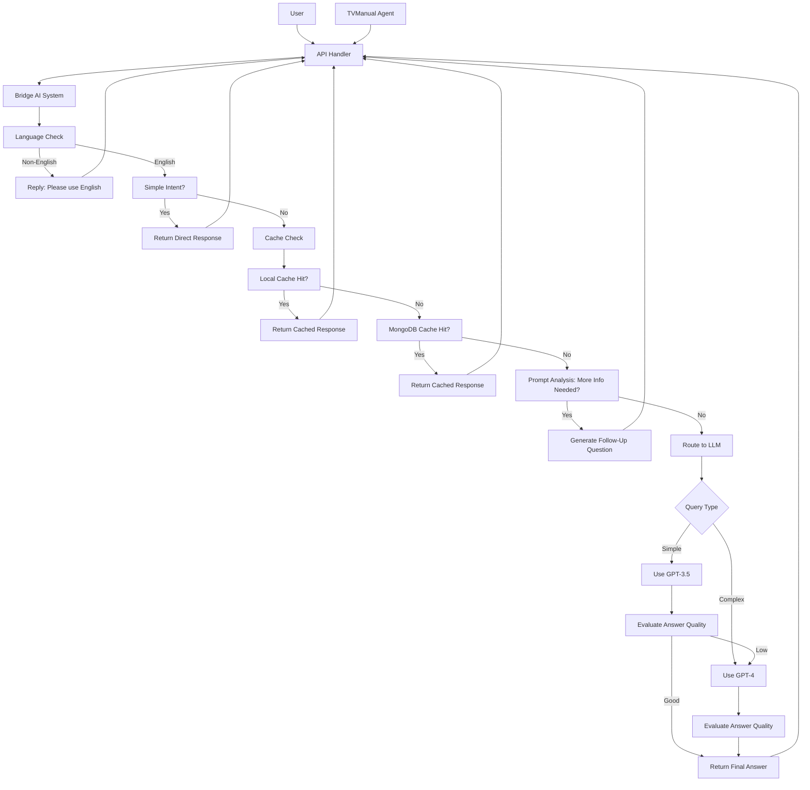

# Bridge AI System

An intelligent question routing system that analyzes user prompts and directs them to the most appropriate AI model for optimal responses.

## 📖 Overview

Bridge AI combines smart caching, prompt analysis, and multi-tier LLM routing to provide efficient and high-quality answers. The system automatically handles simple interactions directly while routing complex queries to appropriate AI models.

### Key Features

- 🧠 **Smart Routing** - Advanced model selection based on query complexity and academic context
- ⚡ **Instant Responses** - Direct handling of greetings, thanks, and simple intents
- 🎯 **Quality Control** - Strict quality assessment with automatic model upgrading
- 💾 **Intelligent Caching** - Semantic similarity matching for fast retrieval
- 📝 **Context-Aware** - Special handling for academic, professional, and technical contexts
- � **Self-Improving** - Automatic response quality evaluation and model selection optimization

## 🚀 Quick Start

Bridge AI is ready to use with minimal setup. Here's what it does:

**Simple interactions** → Instant friendly responses
```python
"Hello!" → "Hey and welcome! What can I help you figure out today?"
"Thanks!" → "You're very welcome! Happy to help 💪"
```

**Complex questions** → Smart routing to best AI model
```python
"Explain quantum computing" → Routes to GPT-4 for detailed explanation
"What is AI?" → Routes to GPT-3.5 for quick definition
```

**Cached responses** → Lightning fast for repeated questions

> **Ready to integrate?** See [Configuration](#configuration) for setup details.

## 🏗️ System Architecture

### Complete System Flow



### Request Flow

**Step-by-step process:**

1. **User** - Web app, or API receives user input
2. **Chat Agent** - Processes UI request and calls Bridge AI
3. **Simple Intent Detection** - Handle greetings, thanks, system info directly
4. **Cache Check** - Look for exact or semantic matches
5. **Prompt Analysis** - Evaluate completeness and informativeness
6. **Response Classification** - Determine simple vs complex processing
7. **LLM Routing** - Route to appropriate model
8. **Quality Assessment** - Evaluate and upgrade if needed
9. **Response Delivery** - Return through agent to user interface

## ⚙️ Core Components

**System components and their status:**

- **Bridge Core** (`bridge.py`) - Main orchestrator with enhanced simple intents ✨ *Enhanced*
- **Cache Manager** (`cache_manager.py`) - Semantic caching with embeddings ✅ *Original*
- **Prompt Analyzer** (`prompt_analyzer.py`) - Smart prompt evaluation ✨ *Enhanced*
- **Response Classifier** (`response_classifier.py`) - Simple vs complex classification ✨ *Enhanced*
- **LLM Router** (`llm_router.py`) - Multi-model routing ✅ *Original*
- **Answer Evaluator** (`answer_evaluator.py`) - Quality assessment and upgrading ✨ *Enhanced*
- **Prompt Enhancer** (`prompt_enhancer.py`) - Context-aware prompt optimization ✅ *Original*
- **Output Manager** (`output_manager.py`) - Response formatting and storage ✅ *Original*

### 1. 🧠 Bridge Core (`bridge.py`)

<details>
<summary><b>Simple Intent Detection (NEW)</b></summary>

The Bridge now handles common interactions directly without LLM processing:

```python
# Greeting Detection
patterns = {
    'greeting': {
        'casual': ['hello', 'hi', 'hey'],
        'formal': ['good morning', 'good afternoon', 'good evening'],
        'multilingual': ['shalom', 'hola', 'bonjour']
    }
}

# Smart Response Selection
if 'good morning' in prompt:
    return "Hello! Great to meet you 😊 How can I help you today?"
elif 'hey' in prompt:
    return "Hey and welcome! What can I help you figure out today?"
```

**Benefits:**
- ⚡ Instant responses (no API calls)
- 💰 Cost reduction for common interactions
- 😊 Friendly, human-like tone
- 🎯 Context-aware response selection

</details>

### 2. 💾 Cache Manager (`cache_manager.py`)

```python
# Semantic Search Example
query_embedding = embedding_model.encode(prompt)
similarities = np.dot(stored_embeddings, query_embedding)
best_match_score = similarities[np.argmax(similarities)]

if best_match_score >= 0.85:  # 85% similarity threshold
    return cached_response
```

### 3. 🔍 Prompt Analyzer (`prompt_analyzer.py`) - Enhanced

**Before (Simple):**
```python
context_elements = {
    'academic': ['subject', 'level', 'purpose']
}
```

**After (Enhanced):**
```python
context_requirements = {
    'academic': {
        'required_elements': {
            'subject': {
                'keywords': ['subject', 'field', 'discipline'],
                'question': "What specific academic subject is this related to?"
            }
        },
        'optional_elements': {...}
    }
}
```

**Assessment Thresholds:**

- **Too Short**: Less than 3 words - needs more detail
- **Basic Question**: 0.4 score - has question structure
- **Contextual Completeness**: 0.7 score - sufficient context
- **High Quality**: 0.9 score - comprehensive and clear

### 4. 🎯 Response Classifier (`response_classifier.py`) - Enhanced

**Classification Logic:**

```python
# Enhanced keyword patterns
classification_patterns = {
    'complex': {
        'analysis_keywords': ['explain', 'analyze', 'compare', 'evaluate'],
        'inquiry_keywords': ['why', 'how'],
        'process_keywords': ['process', 'method', 'steps'],
        'subjective_keywords': ['emotional', 'feel', 'think', 'opinion']
    },
    'simple': {
        'factual_keywords': ['what is', 'where is', 'when is', 'who is'],
        'definition_keywords': ['define', 'list', 'name', 'identify'],
        'quantitative_keywords': ['price', 'cost', 'distance', 'time']
    }
}
```

**Decision Factors:**

- **Keywords**: 
  - Simple: Factual questions, definitions
  - Complex: Analysis, explanations
- **Length**: 
  - Simple: Less than 15 words
  - Complex: More than 15 words
- **Vibe**: 
  - Simple: General topics
  - Complex: Academic, Creative contexts
- **User Preference**: 
  - Simple: "informative" preference
  - Complex: "CoT" (Chain of Thought) preference

### 5. 🔄 LLM Router (`llm_router.py`)

**Model Configuration:**

- **GPT-3.5** (Simple tasks):
  - Max tokens: 500
  - Temperature: 0.7
  - Use case: Quick answers, definitions
  
- **GPT-4** (Complex tasks):
  - Max tokens: 1500
  - Temperature: 0.7
  - Use case: Analysis, detailed explanations

```python
def route_to_llm(self, prompt, response_type):
    config = self.llm2_config if response_type == 'simple' else self.llm3_config
    return self._call_openai_api(prompt, config, config['model_name'])
```

### 6. ⭐ Answer Evaluator (`answer_evaluator.py`) - Enhanced

**Quality Assessment Components:**

- **Content Quality** (40% weight): Positive vs negative indicators
- **Length Adequacy** (20% weight): Optimal 20-200 words
- **Specificity** (20% weight): Examples, details, steps  
- **Confidence Level** (20% weight): Certainty vs uncertainty

**Enhanced Quality Indicators:**

```python
quality_indicators = {
    'negative': {
        'uncertainty': ["i don't know", "i'm not sure", "unclear"],
        'refusal': ["i cannot", "i can't help", "not possible"],
        'generic': ["it depends", "varies", "different for everyone"]
    },
    'positive': {
        'specificity': ["specifically", "precisely", "exactly"],
        'confidence': ["definitely", "certainly", "clearly"],
        'detailed': ["furthermore", "additionally", "for example"]
    }
}
```

**Upgrade Decision:**

```python
upgradeable_models = {
    'GPT-3.5': True,    # ✅ Can upgrade to GPT-4
    'GPT-4': False,     # ❌ Already advanced
    'cache': False,     # ❌ Cache response
    'BRIDGE': False     # ❌ Direct Bridge response
}
```

## 🧪 Testing

- ℹ️ *Note: Some test cases may require updates. Contributions are welcome.*